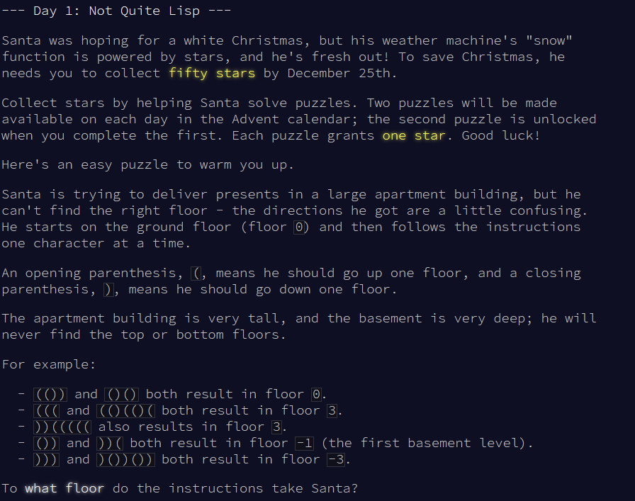
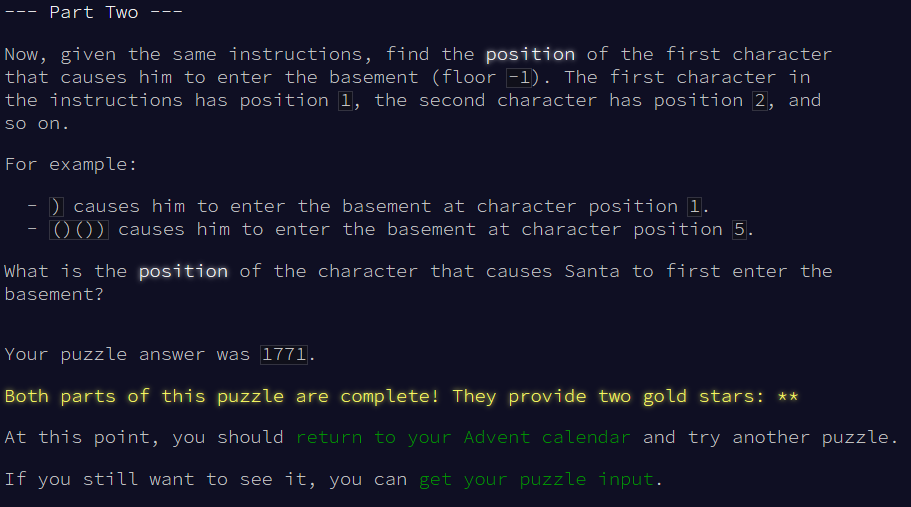
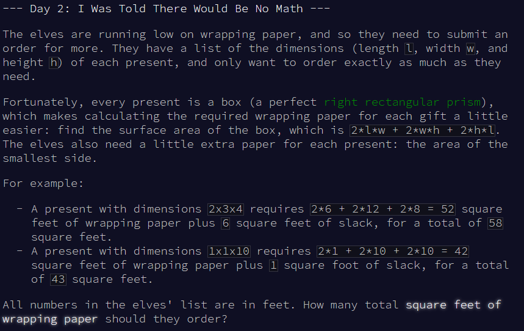
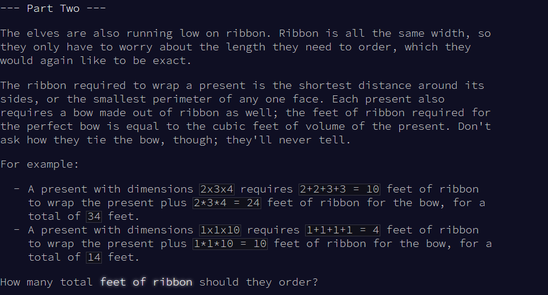
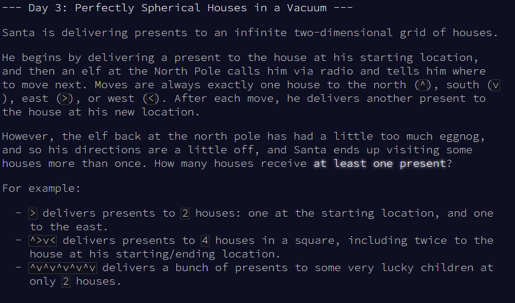
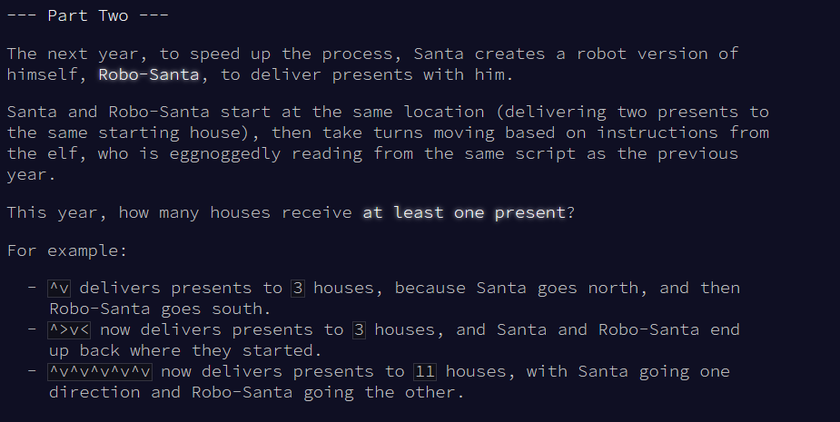

# Advent Of Code 2015 - Erlang

I wanted to practice problem solving in Erlang, so I jumped onto an Advent Of Code event in order to get comfy. The stack used consists solely on Erlang/OTP + leex and yecc. Coming up soon I will be exposing problem solving strategies I took in order to solve this event using my current favorite language, Erlang. The goal of this project is to see how far I can make it in an event I've never done before, as well as how fast.

> NOTE: In this document, when referring to a function, the following format is utilized as per typical Erlang fashion ``function_name/Arity``, where on the left side lies the name, and on the right, the ``Arity`` or param count of the function.

### Generic problem solving strategies

Each pair of AOC problems may look completely unique from the pair next to it. Even then, a series of generic steps can be seen arise throughout this repo. Each solution implementation consists of the following components:

- ``run/1``: Function that handles attaining the first star of a day. It's a composition of the following functions:

  - ``read/1``: This function handles reading the ``Content``'s from the inputted ``FileName``. This is a generic component, that although varies in details between implementations, it largely has the same job. It opens a specified file and proceeds to read it's content and lex/parse it.

  - ``solve/1``: This function takes a ``ParsedInput``, and depending on the problem takes and modifies the original parse structure as needed in order to provide a solution to the problem.

- ``run2/1``: Function that handles attaining the second star of a day. It's a composition of the following functions:

  - ``read/1``: This function generally the same function is used as in ``run/1``

  - ``solve_complete/1``: This function is the second phase's ``solve/1`` equivalent. Tasked with returning a solution designed around the second part of the problem.

## Day 1

In day one, the input is a string containing only opened and closed parenthesis. An open parenthesis is used to signify going up a floor, while the closing parenthesis signifies going down a floor. Your goal is to figure out what floor the instructions took Santa to.

### Part 1

#### Reading input:

Early on when beginning to design the overall structure of ``run/1``, it became quite obvious that I would only be needing a ``leex`` module to handle the input. 

### Part 2

Day 2 Paragraph

## Day 2

Now, for day 2, the elves are running low on wrapping paper, so your responsibility is calculating the size of a present. The input is a list of three numbers grouped together.

### Part 1

Day 2 Paragraph

### Part 2

## Day 3

Day three's problem was quite satisfying to solve so far. For the input you're given a sequence of characters containing: ^ (Up), v (Down), < (Left), > (Right). Each representing a direction santa can move in within a 2D plain.

### Part 1

Day 3 Paragraph

### Part 2

